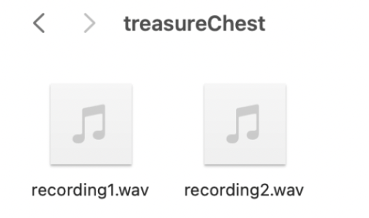
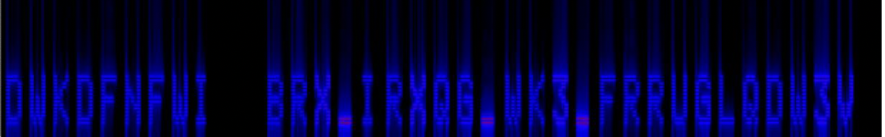

# Dora WriteUp

- Steganography

## Description

Hi! My name is Dora. You will be my assistant 'Dora 0.1'. Can you help me find the lost civilization I have been looking for?

## Attachment

## Solution

(1) binwalk -e basejungle.jpeg.

(2) You will see two audio files which are in treasureChest folder.

\* In Recording1.wav , you will hear Dora saying “listen with your eyes, Dora 0.1” & In Recording2.wav, you will hear beeping sound.

(3) Use tools such as audacity, sonic visualizer to be able to see Ceaser cipher text from Recording2.wav

(4) Convert the ceaser cipher text to plain text and you will get the flag.

## Flag

ATHACKCTF{YOU_FOUND_TH3_COORDINAT3S}
